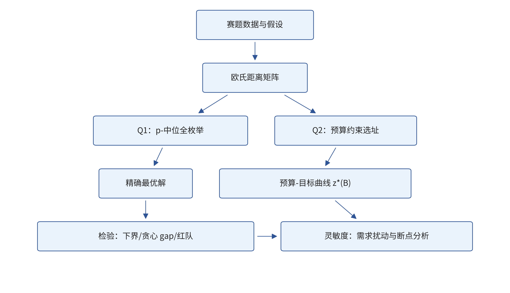
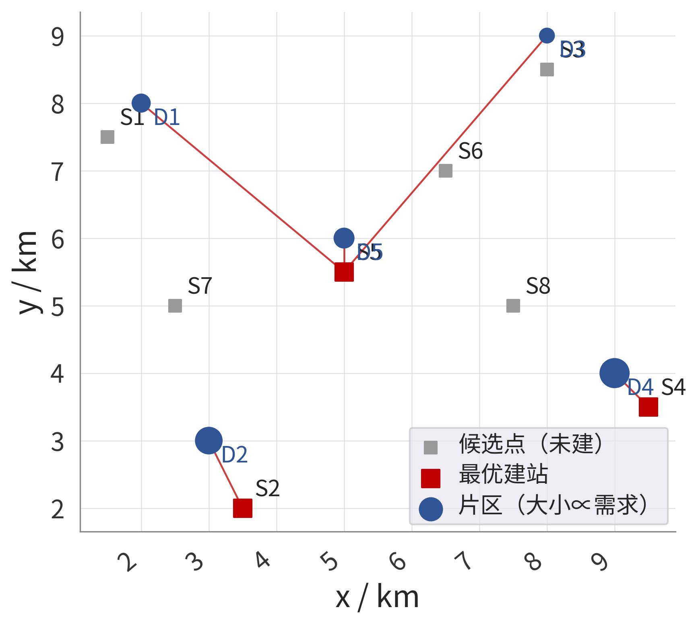
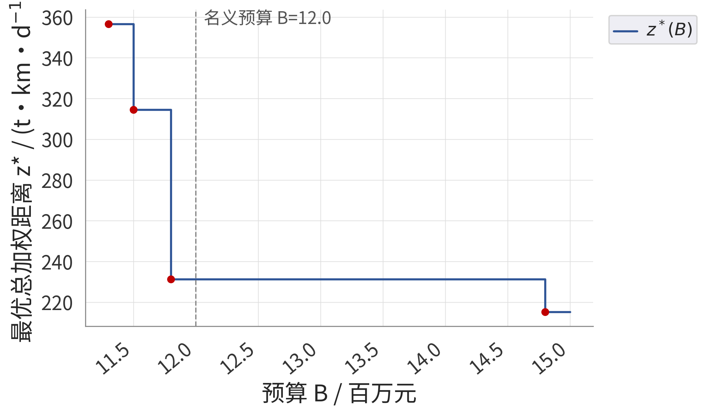
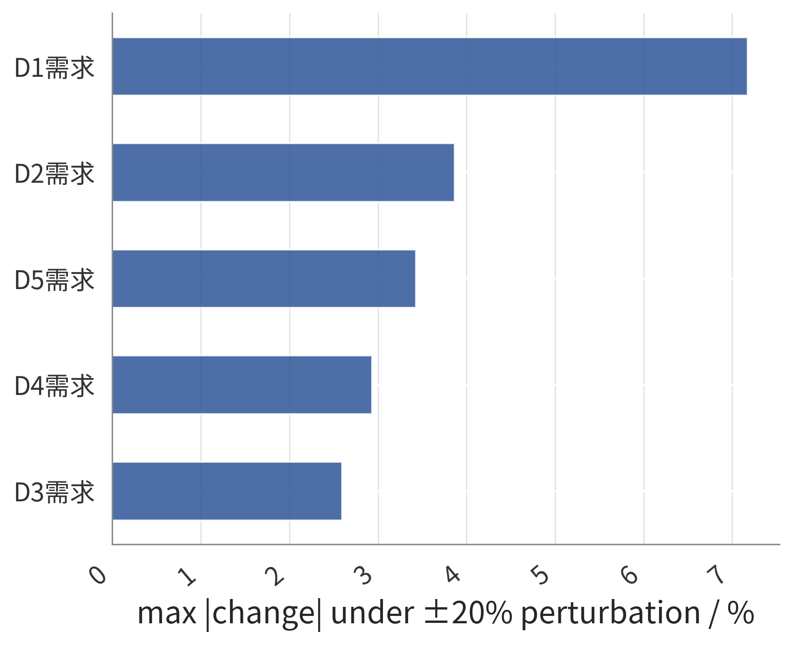
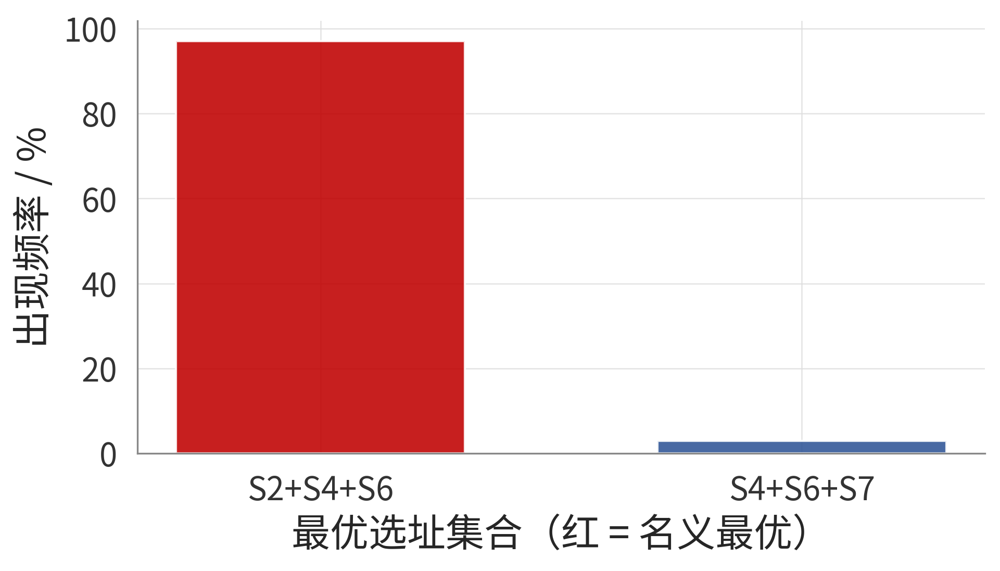
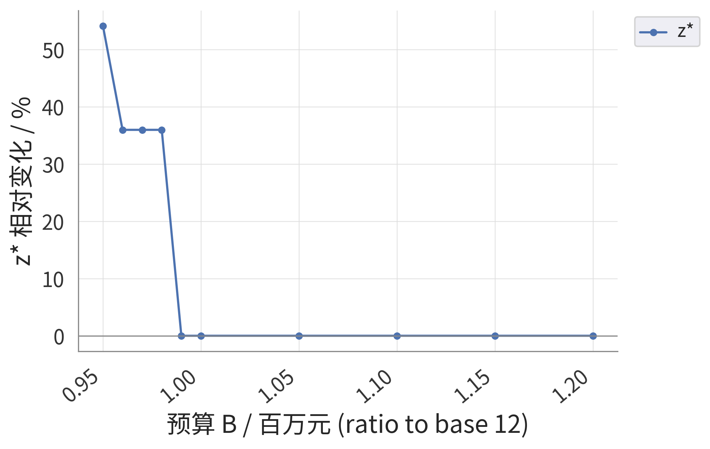

# 基于 p-中位模型的应急物资储备点选址优化

## 摘要

本文研究某城市应急物资储备点的选址决策：5 个片区有差异化的物资需求，需在 8 个候选点中择址建库，目标为最小化需求加权的总配送距离，并进一步纳入建设预算约束讨论方案变化与稳健性。

针对问题一，建立了以总加权距离最小为目标的 p-中位混合整数规划模型。利用"固定建站集合后各片区必选最近站点"的最近指派性质，将内层指派问题化为封闭解，对全部 $\mathrm{C}_8^3=56$ 个候选方案全枚举精确求解，得到全局最优选址 $\{S_2, S_4, S_5\}$，最优总加权距离 $z^*=215.27\ \mathrm{t\cdot km/d}$，折合需求加权平均配送距离 1.54 km；贪心基线与枚举结果一致（gap 为 0），下界对照验证了数值合理性。

针对问题二，在模型中追加建设成本约束，给出最优值函数 $z^*(B)$ 的完整刻画：它是关于预算的分段常数、单调不增函数，共 4 个有效断点。名义预算 $B=12$ 百万元下最优方案切换为 $\{S_2, S_4, S_6\}$（造价 11.8 百万元），目标值 231.30，较无约束最优仅损失 7.45%。灵敏度分析表明：需求整体 ±20% 独立扰动下最优集合翻转率仅 3.0%；单片区需求 ±20% 引起的最优值最大偏差不超过 7.2%；但预算在断点 11.8 百万元下方 2% 以内时目标值跃升 36.0%，呈结构性敏感，据此给出"预算不宜低于 11.8 百万元"的决策建议。

**关键词**：设施选址；p-中位模型；混合整数规划；预算约束；灵敏度分析

## 问题重述

城市应急管理体系要求在突发事件下能够快速向各城区调拨物资，储备点的空间布局直接决定配送时效。某城市划分为 5 个片区，各片区的人口规模与日物资需求不同；城市规划部门预先勘察了 8 个具备建设条件的候选库址，并给出了各候选点的建设造价。需要解决两个递进的决策问题：其一，在不限制造价的情况下，从 8 个候选点中确定 3 个建库位置，使各片区到其服务储备点的需求加权距离总和最小，并给出明确的选址集合与片区—站点服务关系；其二，当建设总经费受预算上限约束时，分析预算额度变化对最优选址集合与配送成本的影响，识别方案切换的临界预算，并通过参数扰动考察所得方案的稳健程度，为规划部门提供可操作的预算—效果权衡依据。

## 问题分析

本题为典型的离散设施选址优化问题，无随机机理、无数据附件，属运筹优化类（B 型）赛题，核心是在组合可行域上求全局最优并回答"参数变化时解如何变"。

问题一的实质是 p-中位（p-median）问题：决策"在哪建"（选址变量）与"谁服务谁"（指派变量）两层结构耦合。若直接求解混合整数规划，需借助通用求解器；但注意到固定选址集合后，最优指派必为"就近服务"，内层问题有封闭解，因此可对 56 个候选集合做全枚举，以极小代价换取**全局精确最优**，避免启发式算法的收敛性争议。同时构造贪心基线与理论下界用于交叉检验。

问题二在问题一基础上增加预算约束，可行域收缩为"造价之和不超过预算"的组合子族。关键观察是：预算作为资源型约束，最优值函数 $z^*(B)$ 为分段常数且单调不增，方案只在有限个断点处切换。因此将预算参数化、扫描全部断点，即可完整回答"预算如何影响方案"；再对需求权重与预算做扰动分析，刻画解的稳健性。整体技术路线如图 1 所示。

{w=12cm}
图 1: 总体技术路线流程图

## 模型假设

1. **需求假设**：各片区日需求量按其人口规模与应急物资人均日储备标准（约 $1.5\sim1.6\ \mathrm{kg}$/人·日）设定，数值见表 1。赛题明确允许使用合理假设数据，本文全部基础数据为假设值，仅用于演示模型与算法，结论的结构性规律（断点位置、翻转率量级）不依赖个别取值。
2. **距离假设**：以片区几何中心与候选点坐标之间的欧氏距离近似实际配送距离，即 $d_{ij}=\sqrt{(x_i-x_j)^2+(y_i-y_j)^2}$。该假设忽略了路网迂回系数，等价于假设各方向道路通达性均匀。
3. **单一服务假设**：每个片区的需求由且仅由一个储备点承担（single sourcing），站点容量不限。该假设使"就近指派"成立，是 p-中位模型的标准设定。
4. **成本假设**：各候选点建设成本为固定造价（含征地与库房建设，见表 2），不计运营成本；预算约束仅作用于建设环节。
5. **静态假设**：规划期内需求与造价不随时间变化，选址为一次性静态决策。

## 符号说明

| 符号 | 含义 | 单位 |
|---|---|---|
| $I,\ J$ | 片区集合 $\{1,\dots,5\}$，候选点集合 $\{1,\dots,8\}$ | — |
| $w_i$ | 片区 $i$ 的日需求量 | t/d |
| $d_{ij}$ | 片区 $i$ 到候选点 $j$ 的距离 | km |
| $c_j$ | 候选点 $j$ 的建设成本 | 百万元 |
| $p$ | 建站数量，$p=3$ | — |
| $B$ | 建设总预算上限 | 百万元 |
| $y_j$ | 0-1 变量，候选点 $j$ 是否建站 | — |
| $x_{ij}$ | 0-1 变量，片区 $i$ 是否由站点 $j$ 服务 | — |
| $z$ | 总加权距离（目标函数） | t·km/d |

## 模型的建立与求解

基础数据如表 1、表 2 所示（假设数据，见假设 1 与假设 4；距离矩阵由假设 2 的公式计算，随附支撑材料）。两问共用同一套数据与符号体系：问题一只使用片区需求与距离矩阵，问题二在此基础上追加候选点造价与预算参数。5 个片区的需求合计 $140\ \mathrm{t/d}$，需求规模最大的 D4（48 t/d）与最小的 D3（12 t/d）相差 4 倍，权重差异足以使选址显著偏向大需求片区；8 个候选点的造价分布在 3.5 至 6.5 百万元之间，中心位置的候选点造价更高，为问题二的权衡埋下伏笔。

表 1: 各片区人口、日需求量与几何中心坐标（假设数据）

| 片区 | 人口 / 万人 | 日需求量 / (t/d) | $x$ / km | $y$ / km |
|---|---|---|---|---|
| D1 城北 | 12 | 18 | 2.0 | 8.0 |
| D2 城西 | 25 | 40 | 3.0 | 3.0 |
| D3 城东 | 8 | 12 | 8.0 | 9.0 |
| D4 城南 | 30 | 48 | 9.0 | 4.0 |
| D5 中心 | 15 | 22 | 5.0 | 6.0 |

表 2: 候选点坐标与建设成本（假设数据）

| 候选点 | $x$ / km | $y$ / km | 成本 / 百万元 |
|---|---|---|---|
| S1 | 1.5 | 7.5 | 4.2 |
| S2 | 3.5 | 2.0 | 3.8 |
| S3 | 8.0 | 8.5 | 5.0 |
| S4 | 9.5 | 3.5 | 4.5 |
| S5 | 5.0 | 5.5 | 6.5 |
| S6 | 6.5 | 7.0 | 3.5 |
| S7 | 2.5 | 5.0 | 4.0 |
| S8 | 7.5 | 5.0 | 4.8 |

### 问题一：总加权距离最小的选址模型

#### 模型的建立

选址决策包含两层相互耦合的 0-1 变量：一是"在哪建"的选址变量 $y_j$，二是"谁服务谁"的指派变量 $x_{ij}$。直觉上，需求越大的片区对总成本的边际影响越强，最优布局必然向其倾斜；但单站服务（假设 3）又迫使每个片区整体归入某一站点，因此问题的本质是"以空间换效率"的组合权衡。以需求量为权重、配送距离为成本，建立 p-中位混合整数规划：

$$\min\ z=\sum_{i\in I}\sum_{j\in J} w_i\, d_{ij}\, x_{ij} \tag{1}$$

$$\text{s.t.}\ \sum_{j\in J} x_{ij}=1,\quad \forall i\in I \tag{2}$$

$$x_{ij}\le y_j,\quad \forall i\in I,\ j\in J \tag{3}$$

$$\sum_{j\in J} y_j=p \tag{4}$$

$$x_{ij},\ y_j\in\{0,1\},\quad \forall i\in I,\ j\in J \tag{5}$$

约束 (2) 表示每个片区恰好由一个储备点服务（假设 3）；约束 (3) 表示片区只能由已建成（$y_j=1$）的站点服务，它将选址层与指派层耦合起来，是模型的核心约束；约束 (4) 限定建站总数为 $p=3$；目标 (1) 的量纲为 $\mathrm{t\cdot km/d}$，即每日全城应急配送的"吨公里"总量，可理解为配送工作量或运输成本的代理指标。

#### 模型的求解

直接调用通用 MILP 求解器可以得到解，但无法免除"启发式是否收敛到全局最优"的疑问。本文利用下述结构性质将模型化为可精确枚举的形式。

**引理（最近指派）**：固定建站集合 $S\subseteq J$ 后，模型的最优指派为每个片区指派给 $S$ 中距离最近的站点。证明：在 $S$ 固定时，目标关于各片区可分离，且约束 (2) 仅要求每片区选择一站，故逐片区取 $\min_{j\in S} d_{ij}$ 即达全局最优。

由引理，对任意 $S$ 有封闭目标值

$$z(S)=\sum_{i\in I} w_i\min_{j\in S} d_{ij} \tag{6}$$

候选集合总数仅为

$$\binom{8}{3}=56 \tag{7}$$

因此对 56 个集合逐一按式 (6) 求值并取最小，即得全局最优解 $z^*=\min_{|S|=3} z(S)$，整个过程在毫秒量级完成，且无近似误差。作为交叉检验，同时实现贪心算法（从空集出发，每步加入使目标下降最多的站点）与理论下界

$$z^*\ge \underline{z}=\sum_{i\in I} w_i \min_{j\in J} d_{ij} \tag{8}$$

式 (8) 放松了"只开 3 站"的耦合约束，允许每片区由各自的全局最近点服务，目标只会更小，故为有效下界。

#### 结果与分析

全枚举求得唯一全局最优选址 $\{S_2, S_4, S_5\}$，最优值

$$z^*=215.27\ \mathrm{t\cdot km/d} \tag{9}$$

折合需求加权平均配送距离 $z^*/\sum_i w_i=215.27/140=1.54\ \mathrm{km}$。各片区服务关系与分担成本如表 3 所示，空间布局如图 2 所示：$S_2$ 贴身服务需求量第二大的城西片区 D2，$S_4$ 贴身服务需求最大的城南片区 D4，位于几何中心的 $S_5$ 同时覆盖城北 D1、城东 D3 与中心 D5 三个片区，呈"两端贴身 + 中心辐射"的合理格局。

表 3: 问题一最优选址的服务指派与成本分担

| 片区 | 服务站点 | 距离 / km | 加权距离 / (t·km/d) | 占比 |
|---|---|---|---|---|
| D1 | S5 | 3.91 | 70.29 | 32.7% |
| D2 | S2 | 1.12 | 44.72 | 20.8% |
| D3 | S5 | 4.61 | 55.32 | 25.7% |
| D4 | S4 | 0.71 | 33.94 | 15.8% |
| D5 | S5 | 0.50 | 11.00 | 5.1% |
| 合计 | — | — | 215.27 | 100% |

{w=12cm}
图 2: 问题一最优选址方案与片区—站点指派关系

全部 56 个方案中排名前 5 者如表 4 所示。次优方案 $\{S_2,S_4,S_6\}$ 与最优方案目标相差 7.45%，说明在造价等其他因素介入时存在有意义的权衡空间——这正是问题二的切入点。

表 4: 问题一全枚举目标值前 5 名方案

| 排名 | 选址集合 | 目标值 / (t·km/d) | 相对最优 |
|---|---|---|---|
| 1 | S2+S4+S5 | 215.27 | 0 |
| 2 | S2+S4+S6 | 231.30 | +7.45% |
| 3 | S3+S4+S7 | 236.38 | +9.81% |
| 4 | S4+S5+S7 | 237.47 | +10.31% |
| 5 | S4+S6+S7 | 240.81 | +11.86% |

### 问题二：预算约束下的选址模型

#### 模型的建立

问题一的最优方案 $\{S_2,S_4,S_5\}$ 造价合计 14.8 百万元，其中中心站 $S_5$ 一站即占 6.5 百万元。当经费受限时，"效率最优"未必"造得起"，需要把预算作为硬约束显式纳入模型。在问题一模型基础上追加建设预算约束：所选站点的造价之和不得超过预算上限 $B$，即

$$\sum_{j\in J} c_j\, y_j\le B \tag{10}$$

其余约束与目标同式 (1)–(5)，模型仍为混合整数规划。约束 (10) 与基数约束 (4) 共同刻画了"在固定数量与有限经费下选哪 3 站"的决策结构；预算每收紧一分，可行组合族就缩小一圈，选址被迫从"效率优先"向"造价优先"迁移。记最优值函数

$$z^*(B)=\min\Big\{z(S):\ |S|=3,\ \sum_{j\in S} c_j\le B\Big\} \tag{11}$$

#### 模型的求解

**命题（分段常数与单调性）**：$z^*(B)$ 是关于 $B$ 的分段常数、单调不增函数。证明：预算放松只会使可行集单调扩张（$B_1\le B_2$ 时 $B_1$ 下可行的方案在 $B_2$ 下仍可行），故最小值不增；可行集是 56 个组合的有限子族，目标值只能在这有限个取值中变化，故分段常数，断点只可能出现在各组合的造价处。

由命题，求解策略为：对 56 个组合同时计算造价与目标值，按造价升序扫描并保留"造价更低时目标从未达到"的记录点，即得 $z^*(B)$ 的完整阶梯与全部有效断点；名义预算取 $B=12.0$ 百万元代入即得当期决策。最小可行预算为造价最低的三站组合 $S_2+S_6+S_7$，即 $B_{\min}=3.8+3.5+4.0=11.3$ 百万元，低于此值问题不可行。

#### 结果与分析

扫描结果如表 5 与图 3 所示：$z^*(B)$ 共 4 个有效断点，数值验证了命题的单调不增性。

表 5: 预算—方案—目标值对应关系（$z^*(B)$ 的有效断点）

| 预算区间 / 百万元 | 最优选址 | 造价 / 百万元 | $z^*$ / (t·km/d) | 较无约束最优损失 |
|---|---|---|---|---|
| $[11.3,\ 11.5)$ | S2+S6+S7 | 11.3 | 356.57 | +65.65% |
| $[11.5,\ 11.8)$ | S1+S2+S6 | 11.5 | 314.55 | +46.12% |
| $[11.8,\ 14.8)$ | S2+S4+S6 | 11.8 | 231.30 | +7.45% |
| $[14.8,\ +\infty)$ | S2+S4+S5 | 14.8 | 215.27 | 0 |

{w=12cm}
图 3: 最优值函数 $z^*(B)$ 的阶梯曲线与有效断点

名义预算 $B=12.0$ 百万元落在区间 $[11.8,14.8)$ 内，最优方案为 $\{S_2,S_4,S_6\}$，造价 11.8 百万元，目标值 231.30，服务关系为 D1、D3、D5 由 $S_6$ 覆盖，D2、D4 仍分别由 $S_2$、$S_4$ 贴身服务。与问题一相比，预算约束挤出的是造价最高的中心站 $S_5$（6.5 百万元），代之以廉价的 $S_6$（3.5 百万元），代价仅是总加权距离上升 7.45%——用 3 百万元的造价节约换取不到 8% 的配送效率损失，性价比显著。

结果同时给出明确的决策建议：**预算不宜跌破 11.8 百万元**。一旦低于该断点，最优方案退化为 $\{S_1,S_2,S_6\}$，目标值跃升 36.0% 至 314.55；而预算从 11.8 追加到 14.8 百万元的边际收益仅为目标下降 7.45%，规划部门可据此权衡投入产出。

## 模型的分析与检验

### 模型检验

**（1）下界对照**。由式 (8) 算得下界 $\underline{z}=108.39$，最优值 $z^*=215.27\ge\underline{z}$，数值自洽；下界偏松是预期的（它允许 5 个片区各用各的最近点，等效于开 5 站），两者差距恰好量化"只开 3 站"这一基数约束的代价。

**（2）贪心基线对照**。贪心算法逐步加入 $S_5$、$S_4$、$S_2$，恰好命中全局最优，gap 为 0。这一方面说明本实例的景观（landscape）较平缓，另一方面以独立算法复核了枚举结果的正确性。

**（3）退化检验**。取 $p=8$（全建）时模型退化为 $z=\sum_i w_i\min_j d_{ij}$，与下界式 (8) 完全一致；$w_i$ 全相等时模型退化为经典无权 p-中位，目标正比于总距离，均符合理论预期。$B\to+\infty$ 时问题二退化为问题一，数值上两模型结果完全一致（$z^*=215.27$，方案 $\{S_2,S_4,S_5\}$），通过退化一致性断言。

**（4）红队对抗检验**。构造 7 组对抗输入主动攻击模型：①将需求最小的 D3 片区需求压至近零，最优集合保持 $\{S_2,S_4,S_5\}$，因为 D3 由共享站 $S_5$ 顺带覆盖，模型对其权重变化不敏感，符合直觉；②复制一个与 $S_1$ 坐标完全相同的候选点，枚举不崩溃、最优值不变且镜像方案成对同值；③在 1000 km 外增设极端远点，任何最优解均不选择它；④将需求最大的 D4 权重放大 10 倍（跨一个数量级），最优集合仍含 D4 的最近站 $S_4$，指派方向正确；⑤预算取断点值 $B=11.3$ 时正确返回临界方案 $\{S_2,S_6,S_7\}$；⑥预算低于 11.3 百万元时求解器如实返回"不可行"而非异常；⑦需求全部归零时目标恒为 0，任意可行解皆为最优，程序正确处理并列情形。全部对抗场景通过。

### 灵敏度分析

**（1）需求权重单参数扰动**。将各片区需求在 $\pm20\%$ 范围内逐一扰动（其余不变），最优值的相对变化如图 4 所示。最大偏差出现在 D1（7.18%），其余依次为 D2（3.87%）、D5（3.43%）、D4（2.94%）、D3（2.59%）。由于目标关于 $w_i$ 是分段线性的，偏差量级与该片区分担的加权距离占比（表 3）一致；全部 45 组扰动中最优选址集合均未翻转，方案对单片区需求估计误差稳健。

{w=12cm}
图 4: 各片区需求 ±20% 扰动引起最优值的最大相对变化对比

**（2）需求整体 Monte Carlo 扰动**。令 5 个片区需求各自独立乘以 $U(0.8,1.2)$ 的随机因子（固定 seed=42，共 200 次），在名义预算下重解模型，最优集合出现频率如图 5 所示：$\{S_2,S_4,S_6\}$ 出现 194 次（97.0%），仅 6 次（3.0%）翻转为 $\{S_4,S_6,S_7\}$。方案在需求整体不确定性下高度稳健，翻转方向也解释了次优竞争者的来源。

{w=12cm}
图 5: 需求独立 ±20% 随机扰动 200 次下各最优集合的出现频率

**（3）预算扰动**。预算在名义值附近的扰动结果如表 6 与图 6 所示。预算上调 5%–20% 最优值不变（处于平台期）；下调 1%（$B=11.88$）仍不变，但下调 2%（$B=11.76$）即跌破 11.8 断点，最优值跃升 35.99%，下调 5% 时跃升 54.16%。预算灵敏度呈显著的"断点邻域结构敏感、平台期不敏感"特征，与命题的分段常数性质完全吻合。

表 6: 预算扰动下最优值的相对变化（基准 $B=12.0$ 百万元）

| 预算比例 | 预算 / 百万元 | $z^*$ 相对变化 |
|---|---|---|
| 0.95 | 11.40 | +54.16% |
| 0.96 | 11.52 | +35.99% |
| 0.97 | 11.64 | +35.99% |
| 0.98 | 11.76 | +35.99% |
| 0.99 | 11.88 | 0.00% |
| 1.00 | 12.00 | 0.00% |
| 1.05–1.20 | 12.60–14.40 | 0.00% |

{w=12cm}
图 6: 预算 ±5% 邻域内最优值的扰动曲线

综合三类扰动可以判断：本模型的解对需求类参数连续、平缓地响应（线性量级、低翻转率），对预算类资源参数则在断点处发生离散跳变；稳健性结论与解析性质（命题）互为印证。

## 模型评价、改进与推广

### 模型的优点

1. **精确性**：利用最近指派引理将 p-中位模型化为 56 个集合的全枚举，获得全局最优解，彻底免除启发式算法的收敛性质疑；gap 为 0。
2. **可解释的结构刻画**：证明了最优值函数 $z^*(B)$ 分段常数、单调不增的性质，4 个有效断点完整刻画预算—方案—成本权衡，直接支撑决策建议。
3. **检验体系完整**：下界对照、贪心基线、退化检验、7 组红队对抗与三层灵敏度分析（单参数、Monte Carlo、预算扰动）相互印证，结论稳健。

### 模型的缺点

1. 距离采用欧氏近似（假设 2），未计入实际路网迂回与通行时间，绝对数值与真实配送成本存在系统性偏差。
2. 单一服务假设（假设 3）不允许片区由多站分担，站点故障情景下的韧性不足。
3. 基础数据为假设值，模型结论的数值部分不能直接用于实际决策，需代入真实统计数据重新求解。

### 改进与推广

模型可沿三个方向推广：引入路网迂回系数或最短路径距离替代欧氏距离；将目标扩展为"加权距离 + 最大距离"的双目标模型（p-中位与 p-中心混合）以兼顾公平性；在需求不确定情形下采用两阶段随机规划或鲁棒优化，把本文的 Monte Carlo 扰动由事后检验升级为事前决策。此外，选址—库存联合优化（location-inventory）可进一步回答"各站储备多少物资"的后续问题。

## 参考文献

[1] Hakimi S L. Optimum locations of switching centers and the absolute centers and medians of a graph[J]. Operations Research, 1964, 12(3): 450-459.

[2] ReVelle C S, Swain R W. Central facilities location[J]. Geographical Analysis, 1970, 2(1): 30-42.

[3] Daskin M S. Network and Discrete Location: Models, Algorithms, and Applications[M]. 2nd ed. Hoboken: John Wiley & Sons, 2013.

[4] 《运筹学》教材编写组. 运筹学[M]. 5版. 北京: 清华大学出版社, 2021.

[5] 司守奎, 孙玺菁. 数学建模算法与应用[M]. 3版. 北京: 国防工业出版社, 2021.

## 附录

附录 A：支撑材料文件列表

- `data/`：districts.csv、candidate_sites.csv（假设数据）、distance_matrix.csv（派生距离矩阵）、SOURCES.md（数据溯源）
- `code/`：q1_pmedian.py（问题一）、q2_budget.py（问题二与灵敏度）、sensitivity.py（扰动扫描工具）
- `results/`：q1_solutions.csv（56 方案全表）、q1_result.json、q1_redteam.json、q2_result.json、q2_budget_curve.csv、q2_mc.json

附录 B：问题一核心求解代码（q1_pmedian.py 节选）

```python
def objective(S, w, D):
    """z(S) = sum_i w_i * min_{j in S} d_ij  （最近指派引理）"""
    S = list(S)
    return float((w * D[:, S].min(axis=1)).sum())

# 全枚举：56 个组合取最小，即全局最优
rows = [(S, objective(S, w, D)) for S in combinations(range(m), P)]
z_star = min(z for _, z in rows)
```

附录 C：问题二预算扫描核心代码（q2_budget.py 节选）

```python
def solve(w, c, D, B):
    """预算约束全枚举：可行组合中取目标最小者"""
    best_z, best_S = np.inf, None
    for S in combinations(range(len(c)), P):
        if c[list(S)].sum() <= B + TOL:
            z = objective(S, w, D)
            if z < best_z - TOL:
                best_z, best_S = z, S
    return best_S, best_z
```
